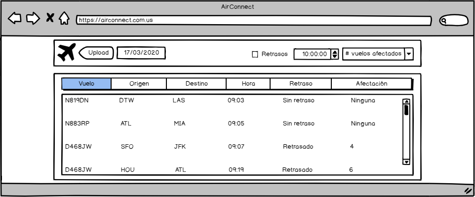
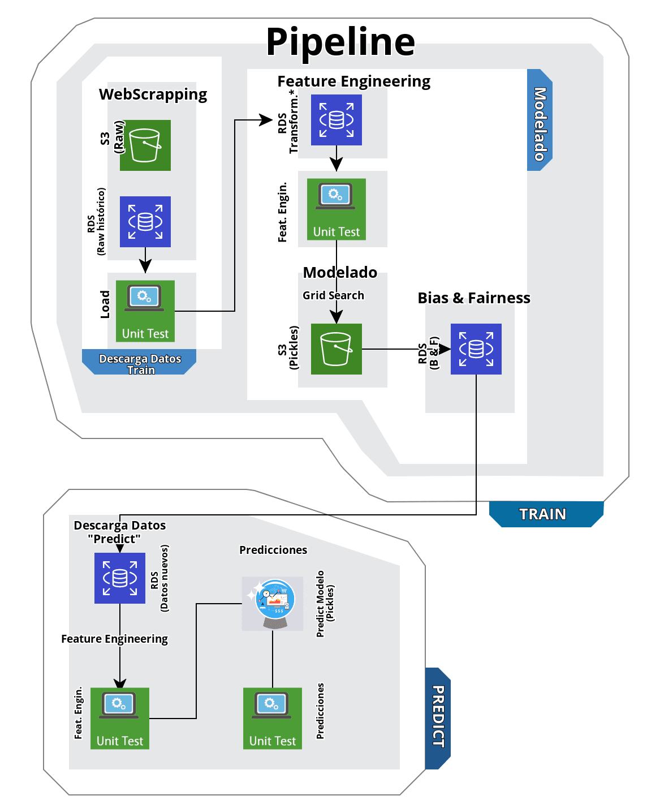
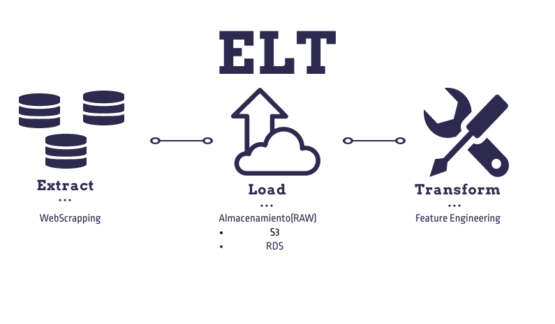
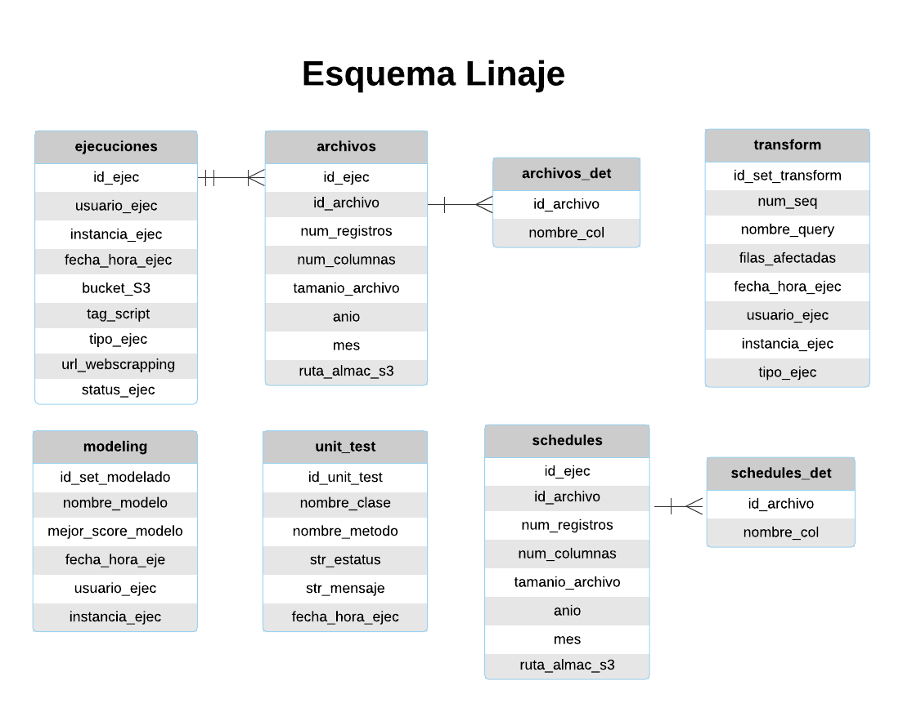

# Retraso y afectación de vuelos operados por Southwest Airlines Co.

El presente proyecto analiza los vuelos de la aerolínea estadounidense *Southwest Airlines Co.* con el fin de detectar retrasos de vuelos de más de 20 minutos en su despegue ocasinando un efecto dominó de 2 o más vuelos consecutivos. Los vuelos operados por la aerolínea *Soutwesth Airlines Co.* representan el 20.6% del total de vuelos nacionales en Estados Unidos, en el periodo comprendido de enero 2016 a diciembre 2019. Durante este periodo, el 25% de los vuelos de la aerolínea sufrieron un retraso en su despegue mayor a 20 minutos. Alertar a la aerolínea con premura sobre posibles retrasos le permitiría conocer anticipadamente pérdidas monetarias asociadas a dichos retrasos, activar planes de contingencia; y tomar acciones encaminadas a la disminución de costos operativos, contribuyendo en la mejora de la eficiencia de sus operaciones.


## Contenidos

1. [Introducción](https://github.com/Millan13/dpa_equipo2#1-introducci%C3%B3n)
2. [Resumen General](https://github.com/Millan13/dpa_equipo2#2-resumen-general)
3. [Requerimientos e Infraestructura](https://github.com/Millan13/dpa_equipo2#3-requerimientos-e-infraestructura)
4. [Instalación y configuración](https://github.com/Millan13/dpa_equipo2#4-instalaci%C3%B3n-y-configuraci%C3%B3n)
5. [Corrida del Pipeline](https://github.com/Millan13/dpa_equipo2#5-corrida-de-pipeline)
6. [Organización del código](https://github.com/Millan13/dpa_equipo2#6-organizaci%C3%B3n-del-c%C3%B3digo)
7. [Colaboradores](https://github.com/Millan13/dpa_equipo2#7-colaboradores)


## 1. Introducción

**Maestría en Ciencia de Datos ITAM**

La maestría en Ciencia de Datos del Instituto Tecnológico Autónomo de México (ITAM) es un programa que busca desarrollar en los estudiantes habilidades computacionales en el diseño y uso de bases de datos en varias escalas de magnitud, dominio de técnicas estadísticas modernas aplicadas al análisis y uso productivo de datos, así como habilidades en el uso de lenguajes de programación y sus aplicaciones para desarrollar software. Como parte del programa de maestría, en segundo semestre se imparte la materia de *Arquitectura y Producto de Datos* la cual tiene como objetivo principal el desarrollo de un producto de datos de inicio a fin. Este proyecto corresponde al producto desarrollado a lo largo del semestre primavera 2020.

## 2. Resumen General

**2.1 Descripción de la base de datos**

La base de datos con la que se trabajará contiene detalles sobre el despegue y arribo de los vuelos comerciales dentro de Estados Unidos de octubre de 1987 a enero de 2020. El dataset contiene alrededor de 100 variables y se encuentra ubicado en [RITA](https://www.transtats.bts.gov/DL_SelectFields.asp?Table_ID=236). La información está disponible en archivos con formato .csv; y en principio es actualizada de forma mensual; sin embargo se desconoce la fecha exacta de actualización.

Considerando la cantidad de variables disponibles y tomando como base la información que fue utilizada en el concurso [data expo Airline on-time performance](http://stat-computing.org/dataexpo/2009/the-data.html), nos limitaremos a trabajar con 15 variables. El detalle y descripción de las variables finales puede encontrase en esta liga [variables](https://github.com/Millan13/dpa_equipo2/blob/dpa-laura/docs/descripcion_variables.md).


**2.2 Mockup**

Con respecto al producto final de datos, se pretende desarrollar una API que permita filtrar por fecha y enliste los vuelos junto con el Origen, Destino, Hora de Salida y una etiqueta binaria adicional, indicando si el despegue de éste se retrasará más de 20 minutos creando un efecto dominó en al menos 2 vuelos consecutivos, o no.



**2.3 Implicaciones éticas**

Sin excepción alguna, cualquier producto de datos trae consigo una serie de implicaciones éticas que deben considerarse en el alcance del modelo.

Particularmente dividimos las implicaciones éticas en falsos positivos y falsos negativos:

+ Falsos positivos
  + Propiciar movilización y sentido de alerta del personal involucrado a raíz de la alerta de retraso, cuando en realidad tal retraso no existirá.
  + Aumento de costos de operación de la aerolínea relacionados con el aumento de horas de trabajo del personal, solicitar equipos de tránsito/seguridad, etc.


+ Falsos negativos
  + Aglomeración de pasajeros en ciertos horarios por tener vuelos retrasados.
  + Falta de espacios disponibles para pasajeros que esperan la salida.
  
  
**2.4 Bias and fairness**


A través de la estadística, intentamos discriminar datos y apoyar en la toma de decisiones; en ese sentido, podemos afectar a algún grupo sin la intención de querer hacerlo, ofreciendo ventajas/desventajas de manera sistemática a un grupo de referencia en particular.

En particular para este modelo, definiremos nuestro grupo de referencia o atributo protegido considerando lo siguiente:

1) Día de la semana que se encuentra laborando el personal.

Lo que buscamos es no realizar alguna afectación únicamente por el hecho de estar contratado bajo cierta jornada laboral a la semana.
Por tanto, basados en la referencia del grupo más grande, seleccionamos como atributo protegido a:

* Grupo 2: Grupo del personal que trabaja el día viernes. 

Por otro lado y con apoyo del personal de aerolíneas, sabemos que sus jornadas laborales estan basados en el número de horas de vuelo. Dichas horas de vuelo comienzan a partir del cierre de puertas de la aeronave hasta la apertura en el lugar de destino. Por tanto, el tiempo en tierra, llamado "tiempo entre calzos" que no es más que el tiempo desde la detención del avión hasta su puesta en marcha de nuevo no está considerado en la jornada del personal.

Considerando que nuestro modelo da información acerca de un posible tiempo de retraso, afectando a un cierto número de vuelos subsecuentes (del mismo avión en el mismo día) es relevante la consecuencia al personal en la decisión de clasificación. Por ende, y buscando asistir al personal informando sobre posibles retrasos, nos interesa reducir el número de Falsos Negativos; es decir, la predicción de que no existirá retraso en tiempo y efecto dominó del avión cuando en realidad si ocurrirá.

Por tanto, las métricas de fairness que utilizaremos será la siguiente:

* False Negative Rate Parity 

Considerando las siguientes razones:

a) El modelo necesita ser muy bueno en detectar la etiqueta positiva.

b) No hay -mucho- costo en introducir falsos positivos al sistema, pues al operador no le impactará saber que existirá una afectación de retraso y efecto dominó cuando no ocurrirá (pues estará preparado).

c) La definición de la variable target no es subjetiva. Ocurre o no ocurre un retraso de más de 20 min con afectación de retraso los siguientes 2 vuelos. 


**2.5 Pipeline**

El pipeline diseñado para analizar el retraso de los vuelos incluye las siguientes etapas:
* **Extract**: Mediante Webscrapping, descargamos los datos del sitio de [RITA](https://www.transtats.bts.gov/DL_SelectFields.asp?Table_ID=236). Se obtienen inicialmente en formato ZIP.
* **Load**: Una vez descomprimidos, los datos se cargan a S3 y al las tablas del esquema `raw` del RDS.
* **Transform**: Se aplica Feature Engineering para obtener las columnas que el modelo requerirá, así como la columna target necesaria para el entrenamiento (si es el caso). 

* **Modelado**: Mediante un magic loop, se obtiene el mejor modelo, mismo que será almacenado en un *pickle* en S3.

* **Evaluación de Bias & Fairness**: Con la ayuda del paquete `aequitas` evaluamos el nivel de sesgo y justicia del modelo seleccionado.

* **Predicción** : Al recibir datos para predicción, se les aplican las transformaciones necesarias para aplicarles la estructura que el modelo requiere como input. Al pasarlos por el modelo almacenado en S3, se obtienen las predicciones.

* **Unit testing** : A lo largo de todos los pasos del pipeline se corren diversas pruebas unitarias para garantizar que el pipeline se corre de manera adecuada o bien, que se detenga su ejecución si se detectan irregularidades.



**2.6 Proceso ELT**

La primera parte del pipeline anterior requiere de un proceso ELT que permita tener los datos en un formato adecuado para poder correr la parte de modelado. De manera breve, el proceso ELT consta de lo siguiente:

>**Extract.** Esta parte del proceso consta de dos etapas. En un primer momento es necesario hacer la carga inicial que permita obtener los datos históricos con los que se desarrollará el producto de datos. Por otro lado, es necesario realizar una carga periódica (mensual) con los datos sobre los cuáles se realizarán las predicciones.

>**Load.** Bajo esta sección del código se establecerá una conexión entre la instancia EC2 y el servicio de almacenamiento S3, en donde permanecerán tanto los datos históricos, como los que se descarguen mensualmente. Adicional, los datos históricos serán enviados al esquema *Raw* ubicado en el servicio RDS, para su posterior transformación.

>**Transform.** El proceso de transformación se puede resumir en 4 fases del proceso:

1. Construcción del Flag Delay para aquellos vuelos retrasados.
2. Creación de la columna de efecto dominó: Se manipuló el dataset para generar un indicador recursivo que permite conocer si el vuelo actual retrasado es consecuencia de un vuelo anterior retrasado en más de 20 minutos.
3. Construcción del número de vuelos retrasados de manera consecutiva: Creación de un contador que permite numerar el número de vuelos acumulados retrasados consecutivamente.
4. Uso de one hot encoding para variables categóricas previo al proceso de selección de variables para entrenamiento del modelo.





**2.7 Linaje**

Puesto que los datos sufren transformaciones a lo largo de todo el pipeline, es importante tener la trazabilidad de todas estas modificaciones. La metadata que se generará durante el pipeline será almacenada en una base de datos conforme a lo siguiente:



El detalle de cada uno de los campos de la metadata se ubica en [diccionario linaje](https://github.com/Millan13/dpa_equipo2/blob/dpa-laura/docs/diccionario_linaje.md).


## 3. Requerimientos e Infraestructura

Los datos que se utilizan son almacenados en un bucket S3 de AWS. Una instancia EC2 de AWS es utilizada para correr todo el código; y los resultados de cada etapa son almacenados en un servicio RDS de AWS.

```
Infraestructura: AWS

+ AMI: ami-0915e09cc7ceee3ab, Amazon Linux AMI 2018.03.0 (HVM)
+ EC2 instance:
  + GPU: 1
  + vCPU: 1
  + RAM: 1 GB
+ OS: Linux AMI 2018.03.0
+ Volumes: 1
  + Type: gp2
  + Size: 16 GB
+ RDS: PostgreSQL
  + Engine: PostgreSQL
  + Engine version: 10.6
  + Instance: db.t2.micro
  + vCPU: 1
  + RAM: 1 GB
  + Storage: 80 GB


```

## 4. Instalación y configuración

**4.1 Requerimientos**

*A partir de ahora, todas las instrucciones deben ejecutarse en la terminal de la instancia ec2.*

En complemento a la infraestructura descrita en el punto 3, será necesario contar con lo siguiente:
+ Python 3
Lo primero que requeriremos, será contar con Python3. Podemos verificar si está instalado con el siguiente comando:
```
yum list installed | grep -i python3
```
Si se nos muestra un texto similar a `Failed to set locale, defaulting to C` procedemos a su instalación con la siguiente instrucción:
```
sudo yum install python36 -y
```

+ git

Instalamos git mediante la instrucción:
```
sudo yum install git-all -y
```
**4.2 Clonar el repositorio**

Después de instalar git, es necesario clonar este repositorio. Posteriormente, desde el directorio `Scripts` ubicado en `dpa_equipo2` se debe correr el script `00_install_packages.sh`.

```
git clone https://github.com/Millan13/dpa_equipo2.git
```

**4.3 Crear archivos de credenciales**

La corrida del pipeline involucra la lectura de una serie de credenciales relacionadas con los servicios S3 y RDS de aws, las cuales deben especificarse en los siguientes dos archivos:

+ **credenciales s3**

Crearemos un archivo `credentials` con  las credenciales de AWS:
```
mkdir .aws
cd .aws
nano credentials
```

Pegar en este archivo *access id* y *key*
```
[default]
aws_access_key_id=<your_key_id>
aws_secret_access_key=<your_secret_key>
aws_session_token=<your_session_token_for_aws_educate_only>
```

+ **credenciales postgres y bucket**

```
cd ../dpa_equipo2/Scripts
nano settings.toml
```

Modificar las siguientes credenciales de postgres y el nombre del bucket a utilizar:
```
# Conexiones RDS
user = 'your_user'
dbname = 'bd_rita'
host = 'your_end-point'
password = 'your_databse_password'

# Modificar el nombre del bucket

# S3
bucket_name = 'your_bucket_name'
```
**4.3 Creación de *pyenv* e instalación de paquetes**

Por último, sugerimos la creación de un *pyenv* en donde se instalarán las paqueterías necesarias. Una vez completados los puntos anteriores, crearemos nuestro *pyenv* mediante:
```
python3 -m venv ~/rita2/env
```
Y procedemos a su activación:
```
source ~/rita2/env/bin/activate
```
Con esto, se mostrará un `(env)` al inicio del cursor. Realizamos la instalación de los paquetes incluidos en el `requirements.txt`:
```
pip3 install -r requirements.txt
```
Finalmente, realizamos las últimas configuraciones necesarias ejecutando:
```
sh 00_install_packages.sh
```
Una vez terminemos, podemos desactivar el *pyenv* con :
```
deactivate
```


## 5. Corrida de Pipeline

Desde el directorio `Scripts` ubicado en `dpa_equipo2` deberá ejecutarse el archivo `Luigi_Inicial.py` indicando la última tarea que debe resolver:

```
python3 -m luigi --module Luigi_Inicial T_130_EnviarMetadataModelado_RDS --local-scheduler
```

O bien, si queremos correr el pipeline entero, lanzaremos:
+ para train
```
python3 -m luigi --module Luigi_Inicial T_Manejador --str-Tipo train 
```
+ para predict 
```
python3 -m luigi --module Luigi_Inicial T_Manejador --str-Tipo predict
```


Notemos que si estamos usando el *centrtal scheduler* omitiremos `--local-scheduler` en los comandos anteriores.


## 6. Organización del código

El código dentro de la carpeta `Scripts` está organizado como sigue:
+ `sql` - Carpeta que contiene los esquemas necesarios para la creación de las tablas de la base de datos.
  + `FeatureEngineering` - subcarpeta que contiene las *queries* utilizadas en el *feature engineering*.
  
+ `testing` - Contiene las funciones a utilizar al correr las pruebas unitarias.

Destacamos además los siguientes archivos:
+ `requirements.txt` - Lista los paquetes necesarios para la ejecución del pipeline
+ `settings.toml` - Contiene las credenciales de acceso al RDS, así como el nombre del bucket S3 a utilizar.
+ `Luigi_Inicial.py` - Módulo de Luigi con la estructura del pipeline.
+ `Unit_Test.py` - Funciones usadas en las pruebas unitarias.
+ `Luigi_Tasks.py` - Funciones usadas en el pipeline de Luigi_Inicial.

  

## 7. Colaboradores

+ Laura Gómez Bustamante
+ Miguel Ángel Millán Dorado
+ Elizabeth Rodríguez Sánchez
+ Marco Julio Monroy Ayala
+ Rodrigo Suárez Segovia
