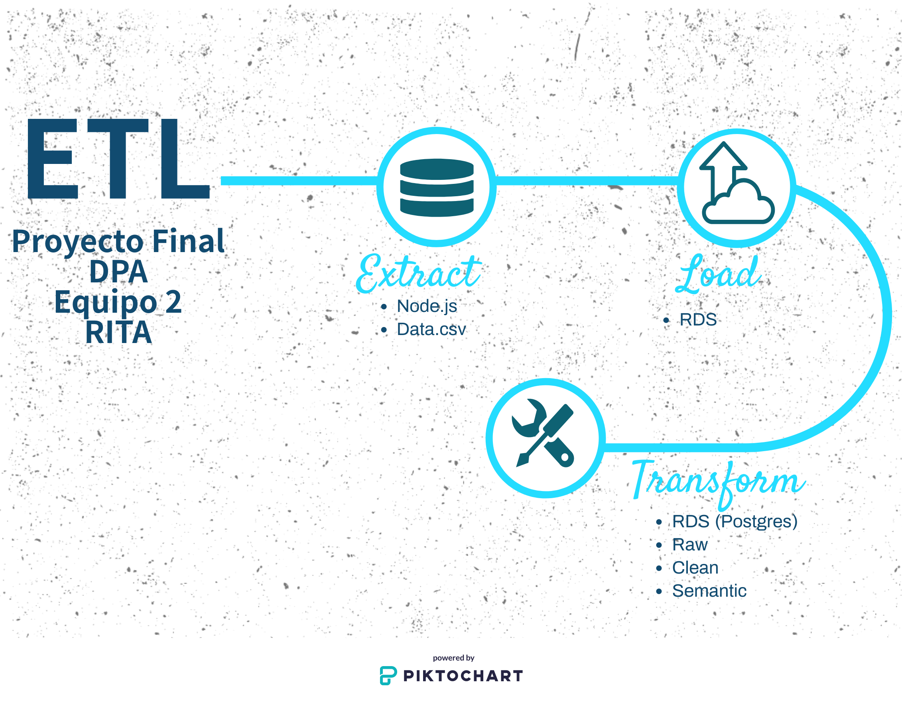

# Proyecto Equipo 2 Arquitectura de producto de datos
Repositorio del equipo 2 del proyecto de la materia Data Product Architecture.

+ Laura Gómez Bustamante 191294 
+ Miguel Ángel Millán Dorado 191401 
+ Elizabeth Rodríguez Sánchez 191430 
+ Marco Julio Monroy Ayala 187825 
+ Rodrigo Suárez Segovia 191351


## Objetivo del proyecto:

Desarrollar un producto de datos que con base en información relacionada con el vuelo (fecha, origen, destino, etc) sea capaz de predecir si la salida de éste tendrá un retraso crítico (mayor a 20 minutos).

## Problemática a resolver:

Los aeropuertos del mundo, sobre todo los más grandes y que mayor tráfico aéreo registran, van 
incorporando poco a poco servicios exclusivos para amenizar al cliente. Convertirse en el mejor 
operador de servicios aeroportuarios requiere de ofrecer servicios con seguridad, eficiencia 
tecnológica y confort de manera sostenible y rentable. Derivado de esto, resulta importante contar con servicios que permitan empoderar y darle libertad a compañías áreas en la experiencia de viaje, brindándole información importante en el momento adecuado para tomar decisiones hacia sus clientes.

## Recursos

+ Información del Departamento de Transporte de los EUA
+ API de Google Maps
+ Servicios de AWS para almacenamiento y procesamiento

## Pipeline


## Descripción de las variables
La información que será utilizada para el desarrollo de este proyecto en principio es actualizada de forma mensual; sin embargo se desconoce la fecha exacta de actualización. Los datos que están disponibles se encuentran en formato .csv, y contienen las siguientes variables:

||Nombre variable	|Descripción|
|---|---|---|
|1	|report	|Year|
|2	|MONTH	|1-12|
|3	|DAY\_OF\_MONTH	|1-31|
|4	|DAY\_OF_WEEK	|1 (Monday) - 7 (Sunday)|
|5	|DEP_TIME	|actual departure time (local, hhmm)|
|6	|CRS\_DEP_TIME	|scheduled departure time (local, hhmm)|
|7	|ARR_TIME	|Actual arrival time (local, hhmm)|
|8	|CRS\_ARR_TIME	|scheduled arrival time (local, hhmm)|
|9	|OP\_UNIQUE_CARRIER|unique carrier code|
|10	|OP\_CARRIER\_FL\_NUM	|flight number|
|11	|TAIL_NUM	|plane tail number|
|12	|ACTUAL\_ELAPSED_TIME	|Elapsed Time of Flight, in minutes|
|13	|CRS\_ELAPSED_TIME	|CRS Elapsed Time of Flight, in minutes|
|14	|AIR_TIME	|Flight Time, in minutes|
|15	|ARR_DELAY	|Difference in minutes between scheduled and actual arrival time. Early arrivals show negative numbers.|
|16	|DEP_DELAY	|Difference in minutes between scheduled and actual departure time. Early departures set to 0.|
|17	|ORIGIN	|origin IATA airport code|
|18	|DEST	|destination IATA airport code|
|19	|DISTANCE	|Distance between airports, in miles|
|20	|TAXI_IN	|taxi in time, in minutes|
|21	|TAXI_OUT	|taxi out time in minutes|
|22	|CANCELLED	|Cancelled Flight Indicator (1=Yes)|
|23	|CANCELLATION_CODE	|reason for cancellation (A = carrier, B = weather, C = NAS, D = security)|
|24	|DIVERTED	|Diverted Flight Indicator, 1 = yes, 0 = no|
|25	|CARRIER_DELAY	|Carrier Delay, in minutes|
|26	|WEATHER_DELAY	|Weather Delay, in minutes|
|27	|NAS_DELAY	|National Air System Delay, in minutes|
|28	|SECURITY_DELAY	|Security Delay, in minutes|
|29	|LATE\_AIRCRAFT_DELAY	|Late Aircraft Delay, in minutes|


## ETL

Como parte del proceso ETL, se tiene considerado utilizar el framework Node.js para descargar la información de la siguiente ubicación https://www.transtats.bts.gov/DL_SelectFields.asp?Table_ID=236. 

Es importante mencionar que en un primer momento deberá obtenerse lo correspondiente al periodo que será utilizado para llevar a cabo el entrenamiento; y posteriormente se realizará una revisión semanal para comprobar si existe información actualizada sobre los vuelos. En caso afirmativo, se descargará la nueva información. El almacenamiento de ambas será realizado en un servicio RDS de AWS.

A través de RDS se utilizará el motor PostgreSQL para crear los esquemas *raw*, *clean* y *semantic*. En el primer esquema se importarán los datos originales y se almacenarán en formato tipo texto. Lo correspondiente a *clean* implicará establecer los tipos de datos adecuados, realizar estandarización de campos que contengan texto, eliminar espacios, entre otras acciones. Así mismo, puede aprovecharse esta parte del proceso para la creación de índices, los cuáles ayudarán a acelerar la consulta entre las tablas del siguiente esquema: *semantic*. Este último está relacionado con la creación de las tablas de entidades y eventos.

















